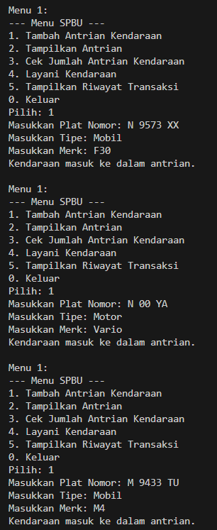
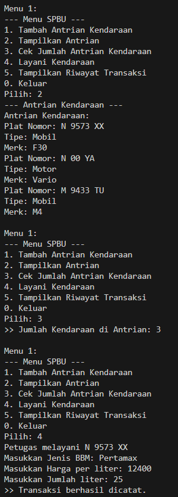
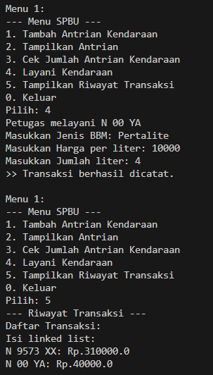
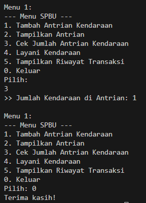

# CASE STUDY 2 :
## Kelompok 6
**Nama** | **NIM**
---------|---------
Fijriati Rahmatur Rizqi | 244107020069
M Rijal Dzaki Rifki A | 244107020240
Khoirul Umam Novalidi | 244107020210

### Penjelasan

Pada kasus SPBU kali ini, kami membuat beberapa class. yaitu:
- [Kendaraan](Kendaraan.java)
- [AntrianKendaraan](AntrianKendaraan.java)
- [BBM](BBM.java)
- [TransaksiPengisian](TransaksiPengisian.java)
- [TransaksiLinkedList](TransaksiLinkedList.java)
- [NodeTransaksi](NodeTransaksi.java)
- [MainSPBU](mainSPBU.java) - sebagai class main.

### Output

